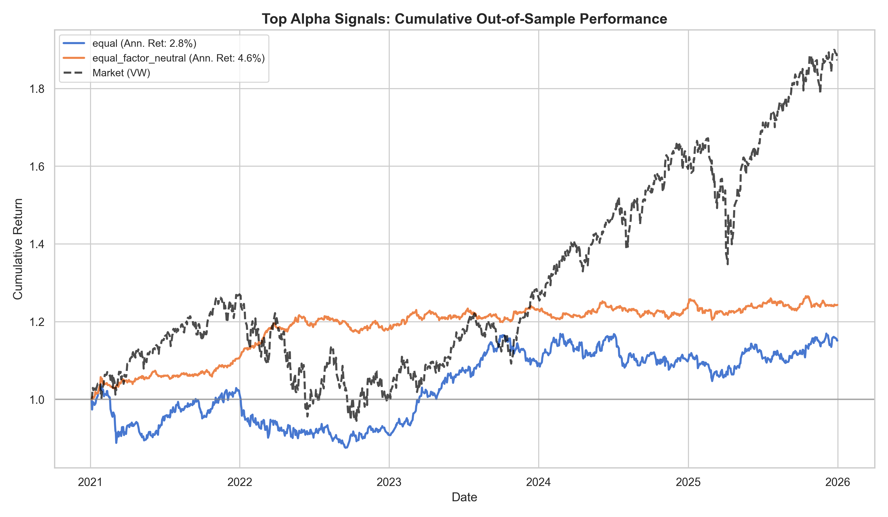

# Alpha Portfolio Report

- **Generated:** 2026-08-02 23:30:13
- **Survivors:** 99  (min|t-stat|=2.0, min|IC|=0.0, cap=none)
- **Backtest:** long-short quintile, out-of-sample (test split), **gross of costs**

## Out-of-sample comparison

| Method | # | IC | ICIR (daily) | Sharpe (ann.) | Ann. Return | Max DD | Turnover |
|---|--:|--:|--:|--:|--:|--:|--:|
| best_single_alpha | 1 | 0.0075 | 0.063 | 0.64 | 6.2% | -14.7% | 0.003 |
| equal | 99 | 0.0033 | 0.028 | 0.33 | 2.8% | -15.8% | 0.013 |
| equal_factor_neutral | 99 | 0.0015 | 0.040 | 1.09 | 4.6% | -4.2% | 0.075 |

**Headline method** (chosen on validation) — `equal`: test Sharpe 0.33, IC 0.0033, Ann. Return 2.8%.

> Caveats: gross of transaction costs; single test window. Daily ICIR annualizes by ×√252. Survivor selection is on validation; orthogonalization parameters are also fit on validation and applied to the held-out test split, and the headline method is chosen on validation — so no test information enters construction or method selection (no look-ahead, no test-set cherry-picking).
