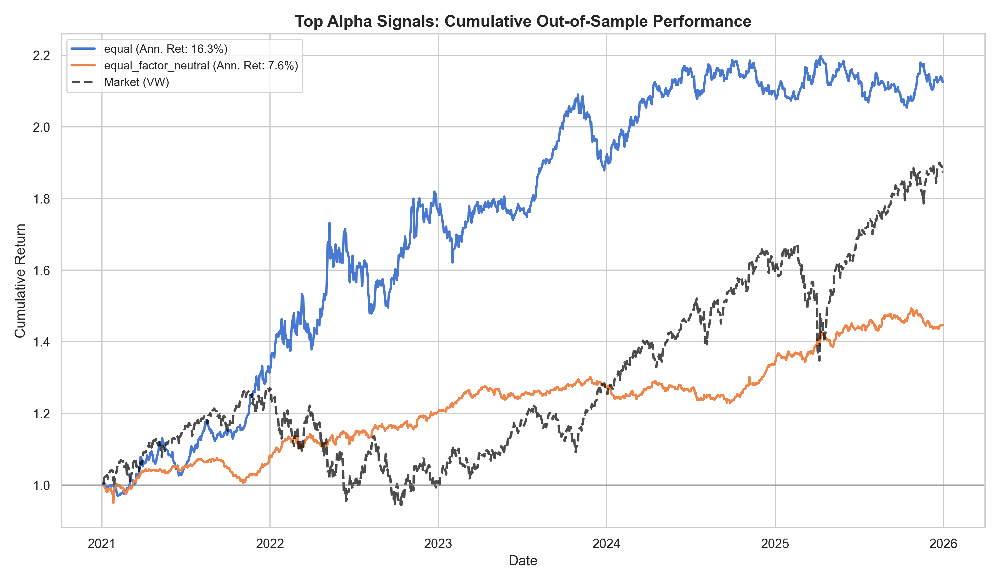

# Alpha Portfolio Report

- **Generated:** 2026-07-22 10:43:51
- **Survivors:** 667  (min|t-stat|=2.0, min|IC|=0.0, cap=none)
- **Backtest:** long-short quintile, out-of-sample (test split), **gross of costs**

## Out-of-sample comparison

| Method | # | IC | ICIR (daily) | Sharpe (ann.) | Ann. Return | Max DD | Turnover |
|---|--:|--:|--:|--:|--:|--:|--:|
| best_single_alpha | 1 | -0.0210 | -0.131 | -0.52 | -9.4% | -50.3% | 0.217 |
| equal | 667 | 0.0168 | 0.140 | 1.20 | 16.3% | -14.6% | 0.041 |
| equal_factor_neutral | 667 | 0.0083 | 0.125 | 1.21 | 7.6% | -6.5% | 0.153 |

**Headline method** (chosen on validation) — `equal`: test Sharpe 1.20, IC 0.0168, Ann. Return 16.3%.

> Caveats: gross of transaction costs; single test window. Daily ICIR annualizes by ×√252. Survivor selection is on validation; orthogonalization parameters are also fit on validation and applied to the held-out test split, and the headline method is chosen on validation — so no test information enters construction or method selection (no look-ahead, no test-set cherry-picking).
