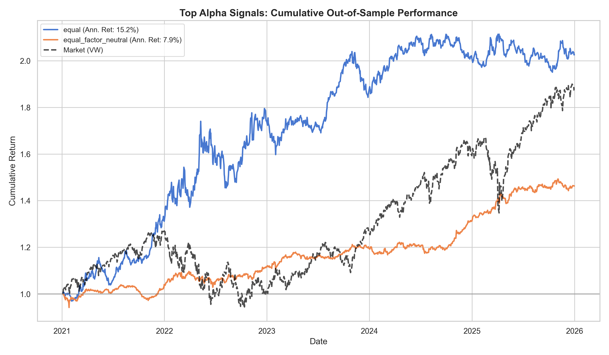

# Alpha Portfolio Report

- **Generated:** 2026-07-22 12:24:41
- **Survivors:** 906  (min|t-stat|=2.0, min|IC|=0.0, cap=none)
- **Backtest:** long-short quintile, out-of-sample (test split), **gross of costs**

## Out-of-sample comparison

| Method | # | IC | ICIR (daily) | Sharpe (ann.) | Ann. Return | Max DD | Turnover |
|---|--:|--:|--:|--:|--:|--:|--:|
| best_single_alpha | 1 | 0.0158 | 0.094 | 0.58 | 8.9% | -19.9% | 0.151 |
| equal | 906 | 0.0160 | 0.127 | 1.08 | 15.2% | -16.4% | 0.032 |
| equal_factor_neutral | 906 | 0.0083 | 0.130 | 1.27 | 7.9% | -6.4% | 0.139 |

**Headline method** (chosen on validation) — `equal`: test Sharpe 1.08, IC 0.0160, Ann. Return 15.2%.

> Caveats: gross of transaction costs; single test window. Daily ICIR annualizes by ×√252. Survivor selection is on validation; orthogonalization parameters are also fit on validation and applied to the held-out test split, and the headline method is chosen on validation — so no test information enters construction or method selection (no look-ahead, no test-set cherry-picking).
